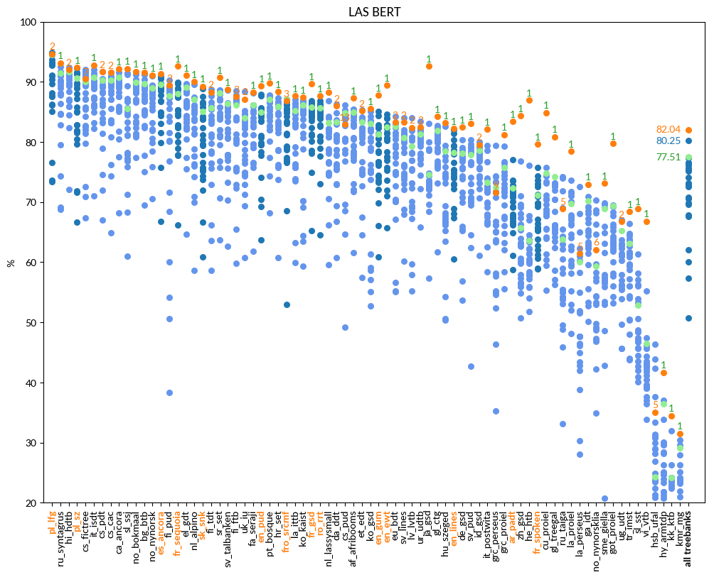
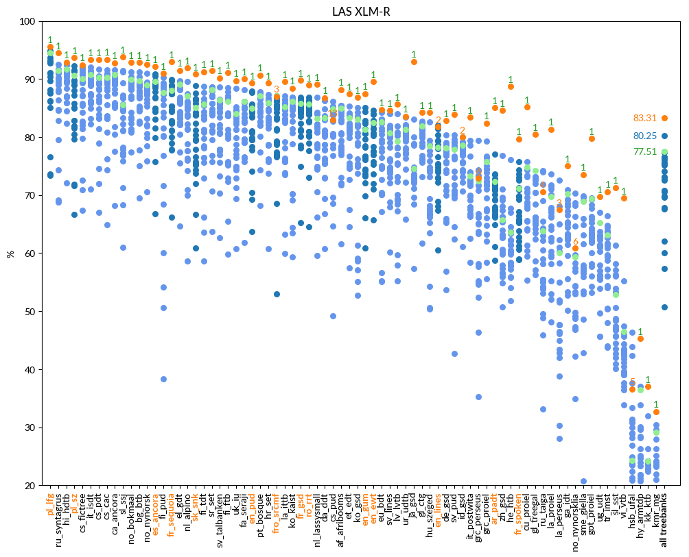

# UDParse

**Soon to come**

UDParse is a fork of UDPipe-Future which in turn is prototype for UDPipe 2.0. The prototype consists of tagging
and parsing and is purely in Python. It participated in CoNLL 2018 UD Shared Task and was one of three winners.
The original code is available at https://github.com/CoNLL-UD-2018/UDPipe-Future.

UDparse has (as UdpipeFuture) the [Mozilla Public License Version 2.0](LICENSE)

UDParse has integrated input sentence vectorisation (with BERT, XLM-Robert-large etc) in order to improve the
quality of the tagged and parsed output.

Compared to the CoNLL 2018 Shared task, UDParse improves on nearly all treebanks considerably:


## LAS 
language | F1 (UDParse BERT) | F1 (UDParse + XLM-R) | F1 (Udpipe) | F1 (winner CoNLL18)
-------- | ---------------- | ------------------- | ----------- | --------------
af_afribooms |  87.34  |  **88.21**  | 84.99 |  85.47  HIT-SCIR (Harbin)
ar_padt  |  83.42  |  **85.04**  | 72.34 |  77.06  Stanford (Stanford)
bg_btb   |  91.53  |  **92.84**  | 89.70 |  91.22  HIT-SCIR (Harbin)
bxr_bdt  |  19.26  |  **19.84**  | 12.61 |  19.53  AntNLP (Shanghai)
ca_ancora |  92.13  |  **92.78**  | 90.79 |  91.61  HIT-SCIR (Harbin)
cs_cac   |  91.54  |  **93.37**  | 90.32 |  91.61  HIT-SCIR (Harbin)
cs_fictree |  90.52  |  **92.46**  | 90.06 |  92.02  HIT-SCIR (Harbin)
cs_pdt   |  91.67  |  **93.35**  | 90.32 |  91.68  HIT-SCIR (Harbin)
cs_pud   |  82.94  |  82.94  | 84.86 |  **86.13** HIT-SCIR (Harbin)
cu_proiel |  84.88  |  **85.21**  | 74.84 |  75.73  Stanford (Stanford)
da_ddt   |  86.04  |  **86.78**  | 83.33 |  86.28  HIT-SCIR (Harbin)
de_gsd   |  82.46  |  **82.85**  | 78.17 |  80.36  HIT-SCIR (Harbin)
el_gdt   |  91.11  |  **91.48**  | 89.05 |  89.65  HIT-SCIR (Harbin)
en_ewt   |  89.40  |  **89.54**  | 82.51 |  84.57  HIT-SCIR (Harbin)
en_gum   |  **87.76** |  87.48  | 81.35 |  85.05  LATTICE (Paris)
en_lines |  **82.22** |  81.73  | 78.26 |  81.97  HIT-SCIR (Harbin)
en_pud   |  89.32  |  **89.32**  | 85.02 |  87.89  LATTICE (Paris)
es_ancora |  91.37  |  **92.12**  | 89.55 |  90.93  HIT-SCIR (Harbin)
et_edt   |  85.17  |  **87.39**  | 83.26 |  85.35  HIT-SCIR (Harbin)
eu_bdt   |  83.32  |  **84.68**  | 82.65 |  84.22  HIT-SCIR (Harbin)
fa_seraji |  88.29  |  **89.99**  | 86.14 |  88.11  HIT-SCIR (Harbin)
fi_ftb   |  87.55  |  **91.13**  | 86.13 |  88.53  HIT-SCIR (Harbin)
fi_pud   |  89.41  |  **90.99**  | 87.69 |  90.23  HIT-SCIR (Harbin)
fi_tdt   |  88.31  |  **91.25**  | 85.72 |  88.73  HIT-SCIR (Harbin)
fr_gsd   |  89.67  |  **89.82**  | 85.74 |  86.89  HIT-SCIR (Harbin)
fr_sequoia |  92.64  |  **92.94**  | 88.04 |  89.89  LATTICE (Paris)
fr_spoken |  79.67  |  **79.69**  | 71.16 |  75.78  HIT-SCIR (Harbin)
fro_srcmf |  86.85  |  87.03  | 87.12 |  **87.12** UDPipe Future (Praha)
ga_idt   |  72.97  |  **75.0**  | 70.22 |  70.88  TurkuNLP (Turku)
gl_ctg   |  84.24  |  **84.25**  | 81.88 |  82.76  Stanford (Stanford)
gl_treegal |  **80.87** |  80.48  | 74.25 |  74.25  UDPipe Future (Praha)
got_proiel |  79.72  |  **79.72**  | 69.39 |  69.55  Stanford (Stanford)
grc_perseus |  71.61  |  72.94  | 72.49 |  **79.39** HIT-SCIR (Harbin)
grc_proiel |  81.22  |  **82.42**  | 75.78 |  79.25  HIT-SCIR (Harbin)
he_htb   |  86.99  |  **88.75**  | 63.65 |  76.09  Stanford (Stanford)
hi_hdtb  |  92.02  |  **92.9**  | 91.75 |  92.41  HIT-SCIR (Harbin)
hr_set   |  88.40  |  **89.35**  | 85.93 |  87.36  HIT-SCIR (Harbin)
hsb_ufal |  35.06  |  36.61  | 24.29 |  **46.42** SLT-Interactions (Bengaluru)
hu_szeged |  83.14  |  **84.27**  | 78.51 |  82.66  HIT-SCIR (Harbin)
hy_armtdp |  41.68  |  **45.3**  | 36.42 |  37.01  LATTICE (Paris)
id_gsd   |  79.59  |  79.98  | 78.58 |  **80.05** HIT-SCIR (Harbin)
it_isdt  |  92.78  |  **93.35**  | 90.75 |  92.00  HIT-SCIR (Harbin)
it_postwita |  82.14  |  **83.41**  | 73.23 |  79.39  HIT-SCIR (Harbin)
ja_gsd   |  92.66  |  **93.03**  | 74.54 |  83.11  HIT-SCIR (Harbin)
kk_ktb   |  34.46  |  **36.98**  | 24.21 |  31.93  Uppsala (Uppsala)
kmr_mg   |  31.53  |  **32.7**  | 29.09 |  30.41  IBM NY (Yorktown Heights)
ko_gsd   |  85.50  |  **86.84**  | 83.12 |  85.14  HIT-SCIR (Harbin)
ko_kaist |  87.40  |  **88.44**  | 86.16 |  86.91  HIT-SCIR (Harbin)
la_ittb  |  87.66  |  **89.55**  | 85.22 |  87.08  HIT-SCIR (Harbin)
la_perseus |  61.49  |  67.46  | 60.08 |  **72.63** HIT-SCIR (Harbin)
la_proiel |  78.49  |  **81.36**  | 69.79 |  73.61  HIT-SCIR (Harbin)
lv_lvtb  |  82.40  |  **85.64**  | 79.32 |  83.97  HIT-SCIR (Harbin)
nl_alpino |  90.03  |  **91.94**  | 87.09 |  89.56  HIT-SCIR (Harbin)
nl_lassysmall |  88.27  |  **89.05**  | 83.15 |  86.84  HIT-SCIR (Harbin)
no_bokmaal |  91.72  |  **92.89**  | 89.98 |  91.23  HIT-SCIR (Harbin)
no_nynorsk |  91.05  |  **92.47**  | 88.97 |  90.99  HIT-SCIR (Harbin)
no_nynorsklia |  62.12  |  60.85  | 59.35 |  **70.34** HIT-SCIR (Harbin)
pl_lfg   |  94.68  |  **95.61**  | 94.53 |  94.86  HIT-SCIR (Harbin)
pl_sz    |  92.35  |  **93.71**  | 90.59 |  92.23  HIT-SCIR (Harbin)
pt_bosque |  89.81  |  **90.69**  | 87.04 |  87.81  Stanford (Stanford)
ro_rrt   |  87.65  |  **88.95**  | 85.65 |  86.87  HIT-SCIR (Harbin)
ru_syntagrus |  93.16  |  **94.54**  | 91.46 |  92.48  HIT-SCIR (Harbin)
ru_taiga |  68.92  |  70.58  | 63.80 |  **74.24** ICS PAS (Warszawa)
sk_snk   |  89.25  |  **90.82**  | 85.06 |  88.85  HIT-SCIR (Harbin)
sl_ssj   |  92.21  |  **93.78**  | 85.59 |  91.47  HIT-SCIR (Harbin)
sl_sst   |  68.87  |  **71.33**  | 52.84 |  61.39  HIT-SCIR (Harbin)
sme_giella |  73.17  |  **73.54**  | 68.95 |  69.87  LATTICE (Paris)
sr_set   |  90.70  |  **91.41**  | 88.15 |  88.66  Stanford (Stanford)
sv_lines |  83.27  |  **84.6**  | 80.68 |  84.08  HIT-SCIR (Harbin)
sv_pud   |  83.03  |  **83.87**  | 77.90 |  80.35  HIT-SCIR (Harbin)
sv_talbanken |  88.71  |  **90.22**  | 86.36 |  88.63  HIT-SCIR (Harbin)
tr_imst  |  68.39  |  **70.62**  | 63.07 |  66.44  HIT-SCIR (Harbin)
ug_udt   |  66.78  |  **69.7**  | 65.23 |  67.05  HIT-SCIR (Harbin)
uk_iu    |  87.12  |  **89.74**  | 84.06 |  88.43  HIT-SCIR (Harbin)
ur_udtb  |  82.47  |  **83.61**  | 81.32 |  83.39  HIT-SCIR (Harbin)
vi_vtb   |  66.81  |  **69.49**  | 46.45 |  55.22  HIT-SCIR (Harbin)
zh_gsd   |  84.32  |  **84.62**  | 65.67 |  76.77  HIT-SCIR (Harbin)






## Other metrics 

* [CLAS](doc/conll18_CLAS.md)
* [UPOS](doc/conll18_UPOS.md)
* [Lemmas](doc/conll18_Lemmas.md)


## Comparison with similar work at Prague University

Milan Straka, Jana Straková, Jan Hajič: Evaluating Contextualized Embeddings on 54 Languages in POS Tagging, Lemmatization and Dependency Parsing (https://arxiv.org/abs/1908.07448),  also use their UDpipe_Future with BERT and other contextual embeddings: Whereas they used data from UD v2.3, we used v2.5 in the following:

### LAS
language   | F1 (UDParse + XLM-R) | F1 (Straka et al.) 
---------- | ------------------- | -------------------
ar_padt    | **85.83**     | 84.62
de_gsd     | **85.03**     | 84.06
en_ewt     | 89.60     | **90.40**
en_gum     | 88.08     | **88.80**
es_ancora  | **92.27**     | 92.03
es_gsd     | 90.02     | **90.11**
fr_gsd     | **92.33**     | 90.31
fr_partut  | 92.16     | **92.47**
fr_sequoia | 92.74     | **93.81**
fr_spoken  | 80.04     | **81.40**
pl_lfg     | 95.47     | **96.03**
pl_pdb     | 93.70     |      
ro_nonstandard | **87.16** | 84.78
ro_rrt     | **88.69**     | 88.05
sk_snk     | 90.65     | **92.15**
wo_wtb     | 79.39     |


### UPOS
language   | F1 (Orange + XLM-R) | F1 (Straka et al.) 
---------- | ------------------- | -------------------
ar_padt    | **97.09**     | 96.98     
de_gsd     | 95.05         | **95.18** 
en_ewt     | **97.26**     | 97.59     
en_gum     | **96.87**     | 96.93     
es_ancora  | **99.14**     | 99.05     
es_gsd     | 97.31         | **97.36**
fr_gsd     | **98.25**     | 97.98     
fr_partut  | **97.39**     | 97.64     
fr_sequoia | 99.14         | **99.32** 
fr_spoken  | 96.52         | **97.23** 
pl_lfg     | 98.94         | **99.16** 
pl_pdb     | 99.19         |           
ro_nonstandard | **97.39** | 96.85     
ro_rrt     | **98.27**     | 98.16     
sk_snk     | 97.48         | **97.70** 
wo_wtb     | 94.86         |           

### MLAS
language   | F1 (Orange + XLM-R) | F1 (Straka et al.) 
---------- | ------------------- | -------------------
ar_padt    | **77.65**  | 76.28    
de_gsd     | **63.41**  | 63.33    
en_ewt     | 82.84  | **84.41**    
en_gum     | 79.05  | **80.14**    
es_ancora  | **87.44**  | 87.03    
es_gsd     | 78.84  | **79.29**
fr_gsd     | **84.39**  | 82.66    
fr_partut  | 77.92  | **80.50**    
fr_sequoia | 87.03  | **89.10**    
fr_spoken  | 71.21  | **73.26**    
pl_lfg     | 88.64  | **90.14**    
pl_pdb     | 87.49  |              
ro_nonstandard | **70.46** | 66.82 
ro_rrt     | **81.73**  | 81.04    
sk_snk     | 79.70  | **81.43**    
wo_wtb     | 66.68  |              


# Installation

We used anaconda in order to install an virtual environment

```
conda create -n udparse
conda activate udparse
pip --no-cache-dir install tensorflow-gpu==2.5.0rc1
pip --no-cache-dir install tensorflow_addons==0.13.0
pip --no-cache-dir install transformers==4.6.1
pip --no-cache-dir install sentencepiece==0.1.95
pip --no-cache-dir install git+https://github.com/andersjo/dependency_decoding 
pip --no-cache-dir install pyyaml
pip --no-cache-dir install matplotlib psutil
```
In order to be able to process raw text, you need to install UDPipe 1.2 tokenizer from
our fork of UDpipe at https://github.com/ioan2/udpipe

```
sudo apt install libpython3.8-dev
git clone https://github.com/ioan2/udpipe
pushd udpipe/src
make
popd

pushd bindings/python
make PYTHON_INCLUDE=/usr/include/python3.8
popd
```

copy UDpipe's `bindings/python/ufal` and `bindings/python/ufal/ufal_udpipe.so` to to UDParse's `bin`.

# Train a model (on [Universal Dependencies](https://universaldependencies.org) data)

First prepare a configuration file `data.yml`

```
configs:
  fr-bert:
    calculate_embeddings: bert
    dev: /universal-dependencies/ud-treebanks-v2.8/UD_French-GSD/fr_gsd-ud-dev.conllu
    embeddings: /universal-dependencies/models/2.8/udpf/tmp/data/fr-bert
    gpu: 0
    out: /universal-dependencies/models/2.8/udpf/fr-bert
    test: /universal-dependencies/ud-treebanks-v2.8/UD_French-GSD/fr_gsd-ud-test.conllu
    tokmodel: /universal-dependencies/models/2.8/tok/fr_gsd.tok.model
    train:
    - /universal-dependencies/ud-treebanks-v2.8/UD_French-GSD/fr_gsd-ud-train.conllu
```

* The tokenizer model (`tokmodel`) must be created using Udpipe 1.2:
* `gpu:` indicates the gpu device starting with 0. If the number given does not correspond to any device or if it is negative
training will be done un CPU.
* `calculate_embeddings` indicates the language model to use. The following are recognized:
  * `bert`: bert-base-multilingual-cased
  * `distilbert`: distilbert-base-multilingual-cased
  * `itBERT`: dbmdz/bert-base-italian-xxl-cased
  * `arBERT`: asafaya/bert-base-arabic
  * `fiBERT`: TurkuNLP/bert-base-finnish-cased-v1
  * `slavicBERT`: DeepPavlov/bert-base-bg-cs-pl-ru-cased
  * `plBERT`: dkleczek/bert-base-polish-uncased-v1
  * `svBERT`: KB/bert-base-swedish-cased
  * `nlBERT`: wietsedv/bert-base-dutch-cased
  * `flaubert`: flaubert/flaubert_base_cased
  * `camembert`: camembert-base 
  * `roberta`: roberta-large
  * `xml-roberta`: jplu/tf-xlm-roberta-large(multilingual)


```
udpipe --train \
       --tagger=none \
       --parser=none \
       --heldout /universal-dependencies/ud-treebanks-v2.8/UD_French-GSD/fr_gsd-ud-dev.conllu \
      /universal-dependencies/models/2.8/tok/fr_gsd.tok.model \
      /universal-dependencies/ud-treebanks-v2.8/UD_French-GSD/fr_gsd-ud-train.conllu
```

Run the train and test:

```
./run.py --action train --yml data.yml fr-bert
./run.py --action test --yml data.yml fr-bert
```

or in one go:

```
./run.py --action tt --yml data.yml fr-bert
```

The training process puts some debugging stuff into the given `out` directory. To copy only the needed stuff, run

```
./bin/clonedata.py data.yml new_directory
```

# Use a model

## Predict a file

Tokenise, tag and parse a raw text

```
././run.py --action predict \
           --yml data.yml \
           --infile inputtext.txt \
           --istext \
           --outfile output.conllu \
           --istext
```

use the option `--presegmented` if the input file contains one sentence per line. Without this option the input text
will be segmented into sentences.

For tokenized (CoNLL-U) files run the following
```
./bin/run.py --action predict \
             --yml data.yml \
             --infile inputtext.conllu
             --outfile output.conllu
```

For a quick check, whether the model works you can use

```
./bin/run.py --action predict \
             --yml data.yml \
             --example "A sentence to be tokenized, tagged and parsed"
```

which prints the output (in CoNLL-U format) to stdout


## Server

TODO


