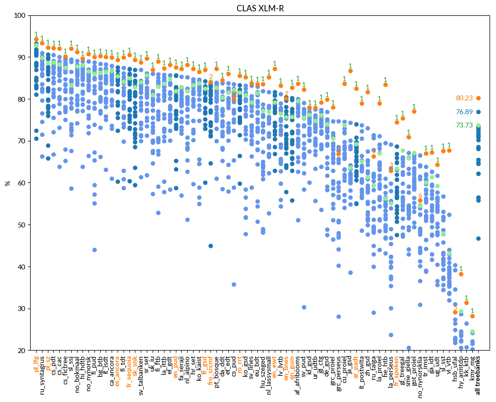

# CLAS

language | F1 (UDParse BERT) | F1 (UDParse + XLM-R) | F1 (Udpipe) | F1 (Best team)
-------- | ---------------- | ------------------- | ----------- | --------------
af_afribooms |  82.52  |  **83.69**  | 79.48 |  80.05  Stanford (Stanford)
ar_padt  |  80.35  |  **82.43**  | 69.26 |  74.00  Stanford (Stanford)
bg_btb   |  88.49  |  **90.23**  | 86.31 |  88.40  HIT-SCIR (Harbin)
bxr_bdt  |  12.04  |  **12.6**  | 7.90 |  12.54  AntNLP (Shanghai)
ca_ancora |  88.80  |  **89.87**  | 86.74 |  87.92  HIT-SCIR (Harbin)
cs_cac   |  89.79  |  **92.08**  | 88.30 |  90.06  HIT-SCIR (Harbin)
cs_fictree |  87.89  |  **90.22**  | 87.45 |  89.61  ICS PAS (Warszawa)
cs_pdt   |  90.09  |  **92.18**  | 88.76 |  90.53  HIT-SCIR (Harbin)
cs_pud   |  79.97  |  79.97  | 82.09 |  **83.57**  HIT-SCIR (Harbin)
cu_proiel |  83.36  |  **83.64**  | 73.70 |  74.52  Stanford (Stanford)
da_ddt   |  83.58  |  **84.48**  | 80.42 |  83.83  HIT-SCIR (Harbin)
de_gsd   |  79.21  |  **79.9**  | 73.98 |  76.92  HIT-SCIR (Harbin)
el_gdt   |  87.46  |  **88.16**  | 84.71 |  85.72  HIT-SCIR (Harbin)
en_ewt   |  86.89  |  **87.24**  | 79.14 |  81.64  HIT-SCIR (Harbin)
en_gum   |  **83.12**  |  82.77  | 75.75 |  80.30  LATTICE (Paris)
en_lines |  **80.61**  |  80.1  | 75.67 |  80.52  HIT-SCIR (Harbin)
en_pud   |  **87.60**  |  87.6  | 81.90 |  85.68  LATTICE (Paris)
es_ancora |  88.18  |  **89.33**  | 85.43 |  87.53  HIT-SCIR (Harbin)
et_edt   |  83.46  |  **86.07**  | 81.50 |  83.74  HIT-SCIR (Harbin)
eu_bdt   |  82.00  |  **83.53**  | 81.45 |  82.97  HIT-SCIR (Harbin)
fa_seraji |  85.16  |  **87.16**  | 82.83 |  85.36  HIT-SCIR (Harbin)
fi_ftb   |  84.93  |  **88.98**  | 83.01 |  85.89  HIT-SCIR (Harbin)
fi_pud   |  88.15  |  **90.0**  | 86.00 |  88.72  HIT-SCIR (Harbin)
fi_tdt   |  86.65  |  **89.9**  | 84.15 |  87.42  HIT-SCIR (Harbin)
fr_gsd   |  86.45  |  **86.94**  | 82.49 |  84.31  HIT-SCIR (Harbin)
fr_sequoia |  90.03  |  **90.47**  | 85.00 |  87.26  LATTICE (Paris)
fr_spoken |  **74.56**  |  74.45  | 63.37 |  68.66  HIT-SCIR (Harbin)
fro_srcmf |  83.70  |  84.05  | 84.11 |  **84.11**  UDPipe Future (Praha)
ga_idt   |  64.64  |  **67.24**  | 61.39 |  62.60  TurkuNLP (Turku)
gl_ctg   |  79.22  |  **79.22**  | 76.10 |  77.43  Stanford (Stanford)
gl_treegal |  **76.18**  |  75.36  | 67.69 |  67.69  UDPipe Future (Praha)
got_proiel |  76.96  |  **77.05**  | 67.10 |  67.10  UDPipe Future (Praha)
grc_perseus |  65.71  |  66.85  | 66.88 |  **74.70**  HIT-SCIR (Harbin)
grc_proiel |  76.55  |  **77.96**  | 70.60 |  74.72  HIT-SCIR (Harbin)
he_htb   |  80.84  |  **83.4**  | 56.26 |  69.48  Stanford (Stanford)
hi_hdtb  |  88.46  |  **89.64**  | 88.08 |  88.99  HIT-SCIR (Harbin)
hr_set   |  85.89  |  **87.19**  | 83.32 |  84.77  HIT-SCIR (Harbin)
hsb_ufal |  27.42  |  29.09  | 18.37 |  **40.33**  SLT-Interactions (Bengaluru)
hu_szeged |  81.96  |  **83.59**  | 77.18 |  81.84  HIT-SCIR (Harbin)
hy_armtdp |  33.73  |  **38.26**  | 29.34 |  29.34  UDPipe Future (Praha)
id_gsd   |  77.67  |  **78.0**  | 76.27 |  77.79  HIT-SCIR (Harbin)
it_isdt  |  89.11  |  **90.01**  | 86.47 |  88.32  HIT-SCIR (Harbin)
it_postwita |  77.59  |  **78.95**  | 65.09 |  73.75  HIT-SCIR (Harbin)
ja_gsd   |  86.35  |  **86.73**  | 63.62 |  74.34  HIT-SCIR (Harbin)
kk_ktb   |  28.70  |  **31.37**  | 18.74 |  26.37  Uppsala (Uppsala)
kmr_mg   |  27.83  |  **28.22**  | 24.49 |  24.49  UDPipe Future (Praha)
ko_gsd   |  83.55  |  **85.15**  | 81.01 |  83.24  HIT-SCIR (Harbin)
ko_kaist |  85.23  |  **86.52**  | 83.74 |  84.65  HIT-SCIR (Harbin)
la_ittb  |  85.27  |  **87.35**  | 83.62 |  85.80  HIT-SCIR (Harbin)
la_perseus |  56.15  |  62.92  | 55.11 |  **69.11**  HIT-SCIR (Harbin)
la_proiel |  75.85  |  **78.92**  | 67.06 |  71.11  HIT-SCIR (Harbin)
lv_lvtb  |  79.75  |  **83.18**  | 76.47 |  81.17  HIT-SCIR (Harbin)
nl_alpino |  85.57  |  **88.2**  | 81.88 |  85.23  HIT-SCIR (Harbin)
nl_lassysmall |  84.07  |  **85.18**  | 76.89 |  81.71  HIT-SCIR (Harbin)
no_bokmaal |  89.71  |  **91.19**  | 87.77 |  89.15  HIT-SCIR (Harbin)
no_nynorsk |  88.86  |  **90.72**  | 86.61 |  88.98  HIT-SCIR (Harbin)
no_nynorsklia |  57.06  |  55.8  | 54.55 |  **66.50**  HIT-SCIR (Harbin)
pl_lfg   |  93.02  |  **94.28**  | 92.85 |  93.18  HIT-SCIR (Harbin)
pl_sz    |  90.65  |  **92.33**  | 88.61 |  90.65  HIT-SCIR (Harbin)
pt_bosque |  86.12  |  **87.21**  | 82.67 |  83.89  HIT-SCIR (Harbin)
ro_rrt   |  83.68  |  **85.57**  | 81.50 |  83.27  HIT-SCIR (Harbin)
ru_syntagrus |  91.60  |  **93.3**  | 89.81 |  91.00  HIT-SCIR (Harbin)
ru_taiga |  64.55  |  66.35  | 59.34 |  **71.44**  ICS PAS (Warszawa)
sk_snk   |  87.42  |  **89.35**  | 82.86 |  87.01  HIT-SCIR (Harbin)
sl_ssj   |  90.01  |  **92.11**  | 83.37 |  89.40  HIT-SCIR (Harbin)
sl_sst   |  65.06  |  **67.6**  | 47.88 |  56.73  HIT-SCIR (Harbin)
sme_giella |  70.35  |  **70.86**  | 65.89 |  67.11  TurkuNLP (Turku)
sr_set   |  88.72  |  **89.66**  | 85.62 |  86.18  Stanford (Stanford)
sv_lines |  82.13  |  **83.74**  | 79.15 |  83.17  HIT-SCIR (Harbin)
sv_pud   |  81.19  |  **82.25**  | 75.51 |  79.01  HIT-SCIR (Harbin)
sv_talbanken |  86.68  |  **88.72**  | 84.08 |  86.94  HIT-SCIR (Harbin)
tr_imst  |  64.54  |  **67.05**  | 60.04 |  63.84  HIT-SCIR (Harbin)
ug_udt   |  60.60  |  **64.31**  | 59.27 |  61.73  HIT-SCIR (Harbin)
uk_iu    |  83.83  |  **86.97**  | 80.93 |  85.99  HIT-SCIR (Harbin)
ur_udtb  |  76.36  |  **77.84**  | 74.79 |  77.57  HIT-SCIR (Harbin)
vi_vtb   |  64.60  |  **67.78**  | 43.13 |  52.44  HIT-SCIR (Harbin)
zh_gsd   |  80.94  |  **81.61**  | 61.41 |  72.99  HIT-SCIR (Harbin)

