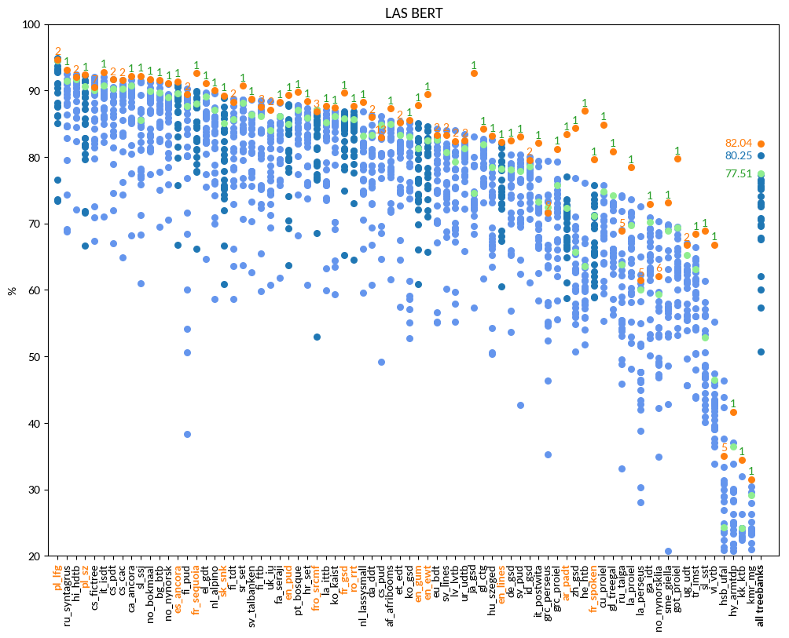
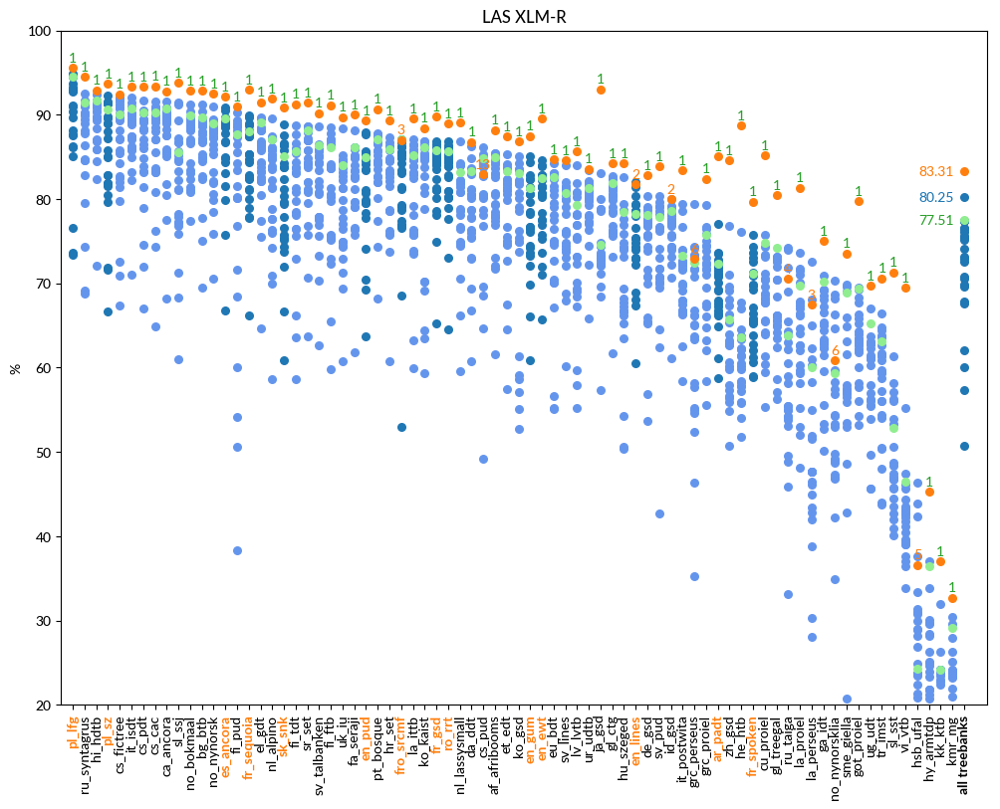

# LAS

language | F1 (UDParse BERT) | F1 (UDParse + XLM-R) | F1 (Udpipe) | F1 (Best team)
-------- | ---------------- | ------------------- | ----------- | --------------
af_afribooms |  87.34  |  **88.21**  | 84.99 |  85.47  HIT-SCIR (Harbin)
ar_padt  |  83.42  |  **85.04**  | 72.34 |  77.06  Stanford (Stanford)
bg_btb   |  91.53  |  **92.84**  | 89.70 |  91.22  HIT-SCIR (Harbin)
bxr_bdt  |  19.26  |  **19.84**  | 12.61 |  19.53  AntNLP (Shanghai)
ca_ancora |  92.13  |  **92.78**  | 90.79 |  91.61  HIT-SCIR (Harbin)
cs_cac   |  91.54  |  **93.37**  | 90.32 |  91.61  HIT-SCIR (Harbin)
cs_fictree |  90.52  |  **92.46**  | 90.06 |  92.02  HIT-SCIR (Harbin)
cs_pdt   |  91.67  |  **93.35**  | 90.32 |  91.68  HIT-SCIR (Harbin)
cs_pud   |  82.94  |  82.94  | 84.86 |  **86.13**  HIT-SCIR (Harbin)
cu_proiel |  84.88  |  **85.21**  | 74.84 |  75.73  Stanford (Stanford)
da_ddt   |  86.04  |  **86.78**  | 83.33 |  86.28  HIT-SCIR (Harbin)
de_gsd   |  82.46  |  **82.85**  | 78.17 |  80.36  HIT-SCIR (Harbin)
el_gdt   |  91.11  |  **91.48**  | 89.05 |  89.65  HIT-SCIR (Harbin)
en_ewt   |  89.40  |  **89.54**  | 82.51 |  84.57  HIT-SCIR (Harbin)
en_gum   |  **87.76**  |  87.48  | 81.35 |  85.05  LATTICE (Paris)
en_lines |  **82.22**  |  81.73  | 78.26 |  81.97  HIT-SCIR (Harbin)
en_pud   |  89.32  |  **89.32**  | 85.02 |  87.89  LATTICE (Paris)
es_ancora |  91.37  |  **92.12**  | 89.55 |  90.93  HIT-SCIR (Harbin)
et_edt   |  85.17  |  **87.39**  | 83.26 |  85.35  HIT-SCIR (Harbin)
eu_bdt   |  83.32  |  **84.68**  | 82.65 |  84.22  HIT-SCIR (Harbin)
fa_seraji |  88.29  |  **89.99**  | 86.14 |  88.11  HIT-SCIR (Harbin)
fi_ftb   |  87.55  |  **91.13**  | 86.13 |  88.53  HIT-SCIR (Harbin)
fi_pud   |  89.41  |  **90.99**  | 87.69 |  90.23  HIT-SCIR (Harbin)
fi_tdt   |  88.31  |  **91.25**  | 85.72 |  88.73  HIT-SCIR (Harbin)
fr_gsd   |  89.67  |  **89.82**  | 85.74 |  86.89  HIT-SCIR (Harbin)
fr_sequoia |  92.64  |  **92.94**  | 88.04 |  89.89  LATTICE (Paris)
fr_spoken |  79.67  |  **79.69**  | 71.16 |  75.78  HIT-SCIR (Harbin)
fro_srcmf |  86.85  |  87.03  | 87.12 |  **87.12**  UDPipe Future (Praha)
ga_idt   |  72.97  |  **75.0**  | 70.22 |  70.88  TurkuNLP (Turku)
gl_ctg   |  84.24  |  **84.25**  | 81.88 |  82.76  Stanford (Stanford)
gl_treegal |  **80.87**  |  80.48  | 74.25 |  74.25  UDPipe Future (Praha)
got_proiel |  79.72  |  **79.72**  | 69.39 |  69.55  Stanford (Stanford)
grc_perseus |  71.61  |  72.94  | 72.49 |  **79.39**  HIT-SCIR (Harbin)
grc_proiel |  81.22  |  **82.42**  | 75.78 |  79.25  HIT-SCIR (Harbin)
he_htb   |  86.99  |  **88.75**  | 63.65 |  76.09  Stanford (Stanford)
hi_hdtb  |  92.02  |  **92.9**  | 91.75 |  92.41  HIT-SCIR (Harbin)
hr_set   |  88.40  |  **89.35**  | 85.93 |  87.36  HIT-SCIR (Harbin)
hsb_ufal |  35.06  |  36.61  | 24.29 |  **46.42**  SLT-Interactions (Bengaluru)
hu_szeged |  83.14  |  **84.27**  | 78.51 |  82.66  HIT-SCIR (Harbin)
hy_armtdp |  41.68  |  **45.3**  | 36.42 |  37.01  LATTICE (Paris)
id_gsd   |  79.59  |  79.98  | 78.58 |  **80.05**  HIT-SCIR (Harbin)
it_isdt  |  92.78  |  **93.35**  | 90.75 |  92.00  HIT-SCIR (Harbin)
it_postwita |  82.14  |  **83.41**  | 73.23 |  79.39  HIT-SCIR (Harbin)
ja_gsd   |  92.66  |  **93.03**  | 74.54 |  83.11  HIT-SCIR (Harbin)
kk_ktb   |  34.46  |  **36.98**  | 24.21 |  31.93  Uppsala (Uppsala)
kmr_mg   |  31.53  |  **32.7**  | 29.09 |  30.41  IBM NY (Yorktown Heights)
ko_gsd   |  85.50  |  **86.84**  | 83.12 |  85.14  HIT-SCIR (Harbin)
ko_kaist |  87.40  |  **88.44**  | 86.16 |  86.91  HIT-SCIR (Harbin)
la_ittb  |  87.66  |  **89.55**  | 85.22 |  87.08  HIT-SCIR (Harbin)
la_perseus |  61.49  |  67.46  | 60.08 |  **72.63**  HIT-SCIR (Harbin)
la_proiel |  78.49  |  **81.36**  | 69.79 |  73.61  HIT-SCIR (Harbin)
lv_lvtb  |  82.40  |  **85.64**  | 79.32 |  83.97  HIT-SCIR (Harbin)
nl_alpino |  90.03  |  **91.94**  | 87.09 |  89.56  HIT-SCIR (Harbin)
nl_lassysmall |  88.27  |  **89.05**  | 83.15 |  86.84  HIT-SCIR (Harbin)
no_bokmaal |  91.72  |  **92.89**  | 89.98 |  91.23  HIT-SCIR (Harbin)
no_nynorsk |  91.05  |  **92.47**  | 88.97 |  90.99  HIT-SCIR (Harbin)
no_nynorsklia |  62.12  |  60.85  | 59.35 |  **70.34**  HIT-SCIR (Harbin)
pl_lfg   |  94.68  |  **95.61**  | 94.53 |  94.86  HIT-SCIR (Harbin)
pl_sz    |  92.35  |  **93.71**  | 90.59 |  92.23  HIT-SCIR (Harbin)
pt_bosque |  89.81  |  **90.69**  | 87.04 |  87.81  Stanford (Stanford)
ro_rrt   |  87.65  |  **88.95**  | 85.65 |  86.87  HIT-SCIR (Harbin)
ru_syntagrus |  93.16  |  **94.54**  | 91.46 |  92.48  HIT-SCIR (Harbin)
ru_taiga |  68.92  |  70.58  | 63.80 |  **74.24**  ICS PAS (Warszawa)
sk_snk   |  89.25  |  **90.82**  | 85.06 |  88.85  HIT-SCIR (Harbin)
sl_ssj   |  92.21  |  **93.78**  | 85.59 |  91.47  HIT-SCIR (Harbin)
sl_sst   |  68.87  |  **71.33**  | 52.84 |  61.39  HIT-SCIR (Harbin)
sme_giella |  73.17  |  **73.54**  | 68.95 |  69.87  LATTICE (Paris)
sr_set   |  90.70  |  **91.41**  | 88.15 |  88.66  Stanford (Stanford)
sv_lines |  83.27  |  **84.6**  | 80.68 |  84.08  HIT-SCIR (Harbin)
sv_pud   |  83.03  |  **83.87**  | 77.90 |  80.35  HIT-SCIR (Harbin)
sv_talbanken |  88.71  |  **90.22**  | 86.36 |  88.63  HIT-SCIR (Harbin)
tr_imst  |  68.39  |  **70.62**  | 63.07 |  66.44  HIT-SCIR (Harbin)
ug_udt   |  66.78  |  **69.7**  | 65.23 |  67.05  HIT-SCIR (Harbin)
uk_iu    |  87.12  |  **89.74**  | 84.06 |  88.43  HIT-SCIR (Harbin)
ur_udtb  |  82.47  |  **83.61**  | 81.32 |  83.39  HIT-SCIR (Harbin)
vi_vtb   |  66.81  |  **69.49**  | 46.45 |  55.22  HIT-SCIR (Harbin)
zh_gsd   |  84.32  |  **84.62**  | 65.67 |  76.77  HIT-SCIR (Harbin)

