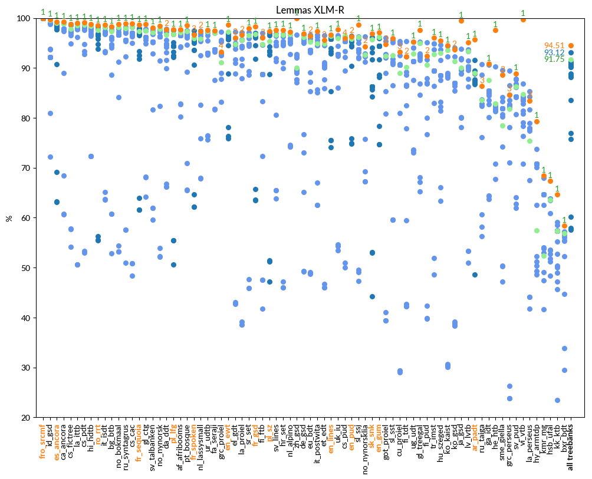

# Lemmas

language | F1 (UDParse BERT) | F1 (UDParse + XLM-R) | F1 (Udpipe) | F1 (Best team)
-------- | ---------------- | ------------------- | ----------- | --------------
af_afribooms |  97.54  |  **97.68**  | 97.11 |  97.59  TurkuNLP (Turku)
ar_padt  |  95.35  |  **95.72**  | 88.94 |  91.61  Stanford (Stanford)
bg_btb   |  98.02  |  **98.31**  | 97.41 |  98.21  TurkuNLP (Turku)
bxr_bdt  |  56.93  |  **58.35**  | 56.83 |  57.24  Fudan (Shanghai)
ca_ancora |  99.15  |  **99.25**  | 98.90 |  98.90  UDPipe Future (Praha)
cs_cac   |  98.55  |  **98.92**  | 98.14 |  98.18  TurkuNLP (Turku)
cs_fictree |  98.61  |  **98.83**  | 97.80 |  98.80  TurkuNLP (Turku)
cs_pdt   |  98.91  |  **99.11**  | 98.71 |  98.71  UDPipe Future (Praha)
cs_pud   |  95.95  |  95.95  | 96.44 |  **96.44**  UDPipe Future (Praha)
cu_proiel |  92.81  |  93.21  | 88.93 |  **95.33**  TurkuNLP (Turku)
da_ddt   |  97.49  |  97.75  | 96.66 |  **97.78**  TurkuNLP (Turku)
de_gsd   |  96.71  |  **96.87**  | 96.14 |  96.69  TurkuNLP (Turku)
el_gdt   |  95.78  |  96.11  | 94.74 |  **97.22**  TurkuNLP (Turku)
en_ewt   |  98.54  |  **98.61**  | 97.23 |  97.23  UDPipe Future (Praha)
en_gum   |  **97.14**  |  97.07  | 96.18 |  96.18  ICS PAS (Warszawa)
en_lines |  **96.70**  |  96.68  | 96.44 |  96.56  TurkuNLP (Turku)
en_pud   |  96.35  |  96.35  | 95.87 |  **96.39**  TurkuNLP (Turku)
es_ancora |  99.22  |  **99.29**  | 99.02 |  99.02  UDPipe Future (Praha)
et_edt   |  95.03  |  95.59  | 94.88 |  **96.57**  TurkuNLP (Turku)
eu_bdt   |  96.18  |  96.45  | 95.19 |  **96.66**  TurkuNLP (Turku)
fa_seraji |  97.12  |  **97.44**  | 97.05 |  97.42  Stanford (Stanford)
fi_ftb   |  95.29  |  96.06  | 94.74 |  **97.02**  TurkuNLP (Turku)
fi_pud   |  91.99  |  92.42  | 90.64 |  **95.07**  TurkuNLP (Turku)
fi_tdt   |  91.49  |  92.27  | 90.18 |  **95.32**  TurkuNLP (Turku)
fr_gsd   |  **98.41**  |  98.3  | 96.75 |  97.03  Stanford (Stanford)
fr_sequoia |  **98.81**  |  98.68  | 97.36 |  97.99  TurkuNLP (Turku)
fr_spoken |  96.90  |  96.7  | 95.98 |  **97.50**  ICS PAS (Warszawa)
fro_srcmf |  **100.00**  |  100.0  | 100.00 |  100.00  AntNLP (Shanghai)
ga_idt   |  90.79  |  **90.82**  | 87.52 |  90.62  TurkuNLP (Turku)
gl_ctg   |  98.68  |  **98.73**  | 97.53 |  97.88  TurkuNLP (Turku)
gl_treegal |  97.44  |  **97.65**  | 95.05 |  95.22  ICS PAS (Warszawa)
got_proiel |  94.62  |  94.75  | 92.39 |  **96.10**  TurkuNLP (Turku)
grc_perseus |  84.34  |  84.67  | 81.78 |  **89.40**  TurkuNLP (Turku)
grc_proiel |  93.24  |  93.29  | 91.08 |  **97.27**  TurkuNLP (Turku)
he_htb   |  97.14  |  **97.6**  | 82.88 |  90.26  Stanford (Stanford)
hi_hdtb  |  98.72  |  **98.8**  | 98.45 |  98.68  TurkuNLP (Turku)
hr_set   |  97.39  |  **97.64**  | 96.69 |  96.83  TurkuNLP (Turku)
hsb_ufal |  66.22  |  **67.36**  | 63.54 |  63.80  Fudan (Shanghai)
hu_szeged |  94.97  |  **95.51**  | 92.99 |  94.61  TurkuNLP (Turku)
hy_armtdp |  78.91  |  **79.35**  | 57.46 |  73.80  CUNI x-ling (Praha)
id_gsd   |  99.63  |  **99.67**  | 99.60 |  99.67  TurkuNLP (Turku)
it_isdt  |  **98.71**  |  98.66  | 98.21 |  98.21  UDPipe Future (Praha)
it_postwita |  96.46  |  **97.32**  | 94.91 |  96.62  TurkuNLP (Turku)
ja_gsd   |  99.41  |  **99.46**  | 90.01 |  93.78  HIT-SCIR (Harbin)
kk_ktb   |  63.75  |  **64.62**  | 57.36 |  59.14  CUNI x-ling (Praha)
kmr_mg   |  67.60  |  **68.39**  | 52.44 |  67.99  CUNI x-ling (Praha)
ko_gsd   |  93.43  |  93.65  | 91.37 |  **94.02**  TurkuNLP (Turku)
ko_kaist |  93.99  |  **94.48**  | 93.53 |  94.39  TurkuNLP (Turku)
la_ittb  |  98.90  |  **99.02**  | 98.56 |  98.77  ICS PAS (Warszawa)
la_perseus |  81.34  |  83.46  | 75.44 |  **85.38**  TurkuNLP (Turku)
la_proiel |  96.16  |  96.64  | 95.54 |  **97.15**  TurkuNLP (Turku)
lv_lvtb  |  94.57  |  **95.17**  | 93.33 |  93.70  TurkuNLP (Turku)
nl_alpino |  97.05  |  **97.29**  | 96.76 |  96.76  UDPipe Future (Praha)
nl_lassysmall |  97.24  |  97.39  | 95.78 |  **97.45**  TurkuNLP (Turku)
no_bokmaal |  98.59  |  **98.8**  | 98.20 |  98.20  UDPipe Future (Praha)
no_nynorsk |  98.26  |  **98.48**  | 97.80 |  97.80  UDPipe Future (Praha)
no_nynorsklia |  94.35  |  94.35  | 92.65 |  **96.28**  ICS PAS (Warszawa)
pl_lfg   |  97.38  |  **97.69**  | 96.73 |  97.63  TurkuNLP (Turku)
pl_sz    |  96.96  |  **97.38**  | 95.31 |  97.01  TurkuNLP (Turku)
pt_bosque |  98.28  |  **98.51**  | 97.38 |  97.54  TurkuNLP (Turku)
ro_rrt   |  98.41  |  **98.56**  | 97.61 |  98.28  TurkuNLP (Turku)
ru_syntagrus |  98.63  |  **98.9**  | 97.94 |  98.19  TurkuNLP (Turku)
ru_taiga |  87.33  |  86.4  | 83.55 |  **90.77**  ICS PAS (Warszawa)
sk_snk   |  96.35  |  **96.84**  | 95.66 |  96.23  TurkuNLP (Turku)
sl_ssj   |  98.30  |  **98.72**  | 96.22 |  96.35  TurkuNLP (Turku)
sl_sst   |  94.88  |  **95.89**  | 92.56 |  95.62  ICS PAS (Warszawa)
sme_giella |  88.36  |  88.59  | 78.43 |  **89.54**  TurkuNLP (Turku)
sr_set   |  97.58  |  **97.92**  | 96.56 |  97.09  TurkuNLP (Turku)
sv_lines |  97.15  |  **97.55**  | 96.61 |  96.90  TurkuNLP (Turku)
sv_pud   |  88.44  |  **88.9**  | 86.23 |  87.79  CEA LIST (Paris)
sv_talbanken |  97.75  |  **98.11**  | 97.08 |  97.82  TurkuNLP (Turku)
tr_imst  |  95.86  |  **96.03**  | 92.74 |  94.86  ICS PAS (Warszawa)
ug_udt   |  **95.36**  |  95.29  | 92.86 |  95.26  Stanford (Stanford)
uk_iu    |  97.18  |  **97.66**  | 95.94 |  96.55  TurkuNLP (Turku)
ur_udtb  |  97.38  |  **97.59**  | 97.33 |  97.42  TurkuNLP (Turku)
vi_vtb   |  99.74  |  **99.76**  | 84.76 |  86.85  Stanford (Stanford)
zh_gsd   |  100.00  |  **99.98**  | 90.01 |  96.70  HIT-SCIR (Harbin)

