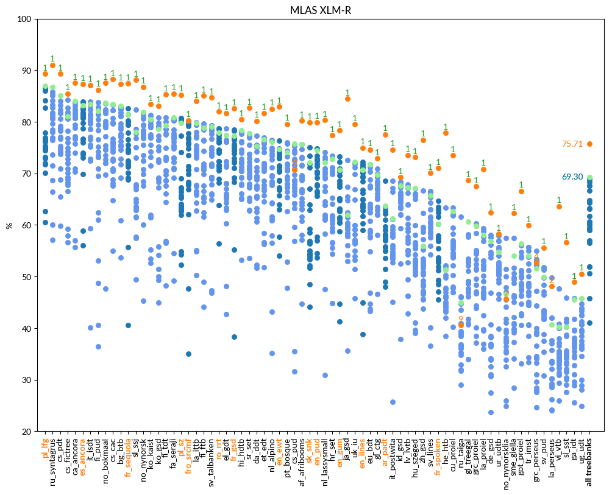

# MLAS

language | F1 (UDParse BERT) | F1 (UDParse + XLM-R) | F1 (Udpipe) | F1 (Best team)
-------- | ---------------- | ------------------- | ----------- | --------------
af_afribooms |  78.87  |  **80.19**  | 75.67 |  75.67  UDPipe Future (Praha)
ar_padt  |  75.15  |  **77.55**  | 63.77 |  68.54  Stanford (Stanford)
bg_btb   |  85.16  |  **87.38**  | 83.12 |  83.12  UDPipe Future (Praha)
bxr_bdt  |  1.32  |  1.4  | 2.09 |  **2.98**  AntNLP (Shanghai)
ca_ancora |  86.34  |  **87.58**  | 84.07 |  84.07  UDPipe Future (Praha)
cs_cac   |  85.21  |  **88.27**  | 83.42 |  83.42  UDPipe Future (Praha)
cs_fictree |  81.65  |  **85.49**  | 81.11 |  84.23  ICS PAS (Warszawa)
cs_pdt   |  86.43  |  **89.32**  | 85.10 |  85.10  UDPipe Future (Praha)
cs_pud   |  70.74  |  70.74  | 75.81 |  **75.81**  UDPipe Future (Praha)
cu_proiel |  73.00  |  **73.52**  | 62.60 |  63.31  Stanford (Stanford)
da_ddt   |  78.43  |  **80.17**  | 75.29 |  77.31  Stanford (Stanford)
de_gsd   |  61.62  |  **62.42**  | 56.84 |  58.04  TurkuNLP (Turku)
el_gdt   |  80.24  |  **81.61**  | 77.43 |  78.66  Stanford (Stanford)
en_ewt   |  82.38  |  **82.91**  | 74.71 |  76.33  Stanford (Stanford)
en_gum   |  **78.81**  |  78.31  | 70.74 |  73.24  ICS PAS (Warszawa)
en_lines |  **75.29**  |  74.99  | 70.66 |  72.25  ICS PAS (Warszawa)
en_pud   |  79.91  |  **79.91**  | 74.45 |  74.86  Stanford (Stanford)
es_ancora |  85.80  |  **87.28**  | 83.16 |  83.93  Stanford (Stanford)
et_edt   |  78.51  |  **81.72**  | 76.62 |  76.97  TurkuNLP (Turku)
eu_bdt   |  72.70  |  **74.62**  | 71.73 |  71.73  UDPipe Future (Praha)
fa_seraji |  83.27  |  **85.49**  | 80.83 |  80.83  UDPipe Future (Praha)
fi_ftb   |  79.74  |  **85.1**  | 78.77 |  79.65  TurkuNLP (Turku)
fi_pud   |  83.89  |  **86.19**  | 82.17 |  83.78  Stanford (Stanford)
fi_tdt   |  81.19  |  **85.27**  | 79.25 |  80.84  Stanford (Stanford)
fr_gsd   |  82.17  |  **82.62**  | 77.29 |  78.44  Stanford (Stanford)
fr_sequoia |  87.32  |  **87.44**  | 81.45 |  82.55  Stanford (Stanford)
fr_spoken |  **71.17**  |  71.03  | 60.17 |  64.67  HIT-SCIR (Harbin)
fro_srcmf |  79.85  |  **80.29**  | 80.28 |  80.28  UDPipe Future (Praha)
ga_idt   |  46.91  |  **48.93**  | 45.53 |  45.79  TurkuNLP (Turku)
gl_ctg   |  **73.07**  |  72.89  | 69.75 |  70.92  Stanford (Stanford)
gl_treegal |  68.39  |  **68.68**  | 60.63 |  60.63  UDPipe Future (Praha)
got_proiel |  66.26  |  **66.57**  | 56.45 |  56.45  UDPipe Future (Praha)
grc_perseus |  50.33  |  52.7  | 51.55 |  **54.98**  HIT-SCIR (Harbin)
grc_proiel |  65.62  |  **67.48**  | 59.82 |  60.27  Stanford (Stanford)
he_htb   |  74.71  |  **77.86**  | 51.36 |  63.38  Stanford (Stanford)
hi_hdtb  |  78.74  |  **80.49**  | 78.30 |  78.30  UDPipe Future (Praha)
hr_set   |  75.19  |  **77.37**  | 72.85 |  73.44  Stanford (Stanford)
hsb_ufal |  4.11  |  4.64  | 3.41 |  **9.09**  LATTICE (Paris)
hu_szeged |  70.59  |  **73.15**  | 67.13 |  67.13  UDPipe Future (Praha)
hy_armtdp |  7.43  |  **9.31**  | 4.14 |  13.36  CUNI x-ling (Praha)
id_gsd   |  68.83  |  **69.22**  | 67.58 |  68.36  Stanford (Stanford)
it_isdt  |  86.20  |  **87.12**  | 83.46 |  83.89  Stanford (Stanford)
it_postwita |  72.96  |  **74.62**  | 61.29 |  68.50  Stanford (Stanford)
ja_gsd   |  83.97  |  **84.5**  | 61.99 |  72.62  HIT-SCIR (Harbin)
kk_ktb   |  5.46  |  6.59  | 7.62 |  **8.93**  CUNI x-ling (Praha)
kmr_mg   |  3.44  |  3.24  | 2.40 |  **7.98**  IBM NY (Yorktown Heights)
ko_gsd   |  81.17  |  **83.11**  | 78.56 |  80.85  HIT-SCIR (Harbin)
ko_kaist |  81.90  |  **83.45**  | 80.46 |  81.29  HIT-SCIR (Harbin)
la_ittb  |  81.12  |  **83.99**  | 79.73 |  79.84  ICS PAS (Warszawa)
la_perseus |  41.23  |  48.12  | 40.75 |  **49.77**  ICS PAS (Warszawa)
la_proiel |  66.72  |  **70.84**  | 58.03 |  59.36  Stanford (Stanford)
lv_lvtb  |  69.98  |  **73.56**  | 67.24 |  67.89  Stanford (Stanford)
nl_alpino |  79.32  |  **82.54**  | 76.09 |  76.52  Stanford (Stanford)
nl_lassysmall |  78.90  |  **80.38**  | 72.10 |  74.11  Stanford (Stanford)
no_bokmaal |  85.63  |  **87.55**  | 83.68 |  83.68  UDPipe Future (Praha)
no_nynorsk |  84.35  |  **86.78**  | 81.86 |  81.86  UDPipe Future (Praha)
no_nynorsklia |  46.59  |  45.63  | 46.57 |  **57.51**  ICS PAS (Warszawa)
pl_lfg   |  87.00  |  **89.29**  | 86.93 |  86.93  UDPipe Future (Praha)
pl_sz    |  81.88  |  **85.25**  | 79.76 |  80.77  Stanford (Stanford)
pt_bosque |  77.86  |  **79.56**  | 74.16 |  75.94  Stanford (Stanford)
ro_rrt   |  80.28  |  **82.03**  | 77.94 |  78.68  TurkuNLP (Turku)
ru_syntagrus |  88.60  |  **91.03**  | 86.76 |  86.76  UDPipe Future (Praha)
ru_taiga |  37.43  |  40.55  | 44.93 |  **61.59**  ICS PAS (Warszawa)
sk_snk   |  76.73  |  **79.84**  | 72.08 |  75.01  Stanford (Stanford)
sl_ssj   |  85.25  |  **88.14**  | 77.95 |  82.38  Stanford (Stanford)
sl_sst   |  53.64  |  **56.61**  | 40.24 |  45.93  ICS PAS (Warszawa)
sme_giella |  61.35  |  **62.26**  | 54.07 |  57.47  TurkuNLP (Turku)
sr_set   |  81.52  |  **82.72**  | 77.73 |  77.73  UDPipe Future (Praha)
sv_lines |  68.28  |  **70.1**  | 65.77 |  66.58  Stanford (Stanford)
sv_pud   |  54.17  |  **55.61**  | 49.90 |  51.74  TurkuNLP (Turku)
sv_talbanken |  81.92  |  **84.71**  | 79.08 |  79.32  Stanford (Stanford)
tr_imst  |  57.38  |  **59.88**  | 54.02 |  55.73  Stanford (Stanford)
ug_udt   |  46.80  |  **50.54**  | 45.78 |  45.78  UDPipe Future (Praha)
uk_iu    |  75.50  |  **79.53**  | 72.27 |  72.27  UDPipe Future (Praha)
ur_udtb  |  56.42  |  **58.24**  | 54.72 |  57.98  TurkuNLP (Turku)
vi_vtb   |  60.25  |  **63.62**  | 40.26 |  47.61  HIT-SCIR (Harbin)
zh_gsd   |  75.84  |  **76.51**  | 55.97 |  66.62  HIT-SCIR (Harbin)

