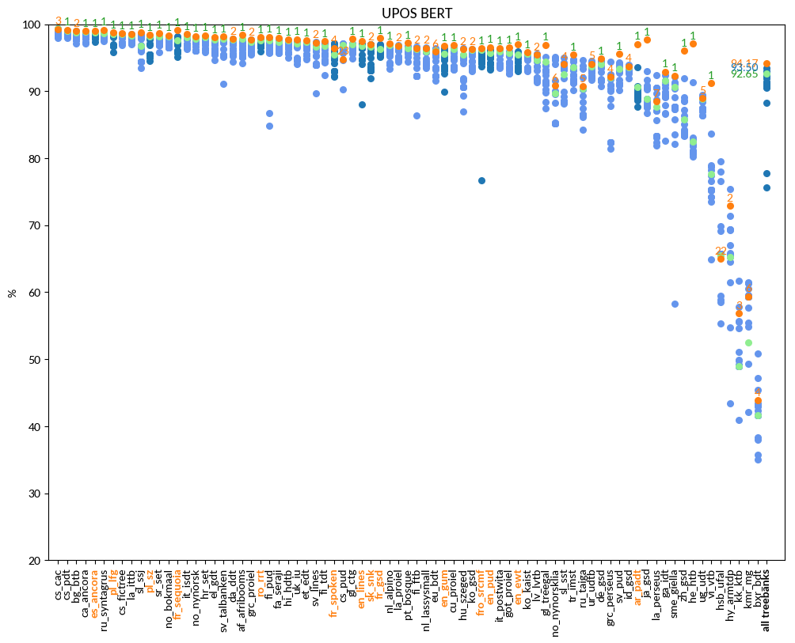
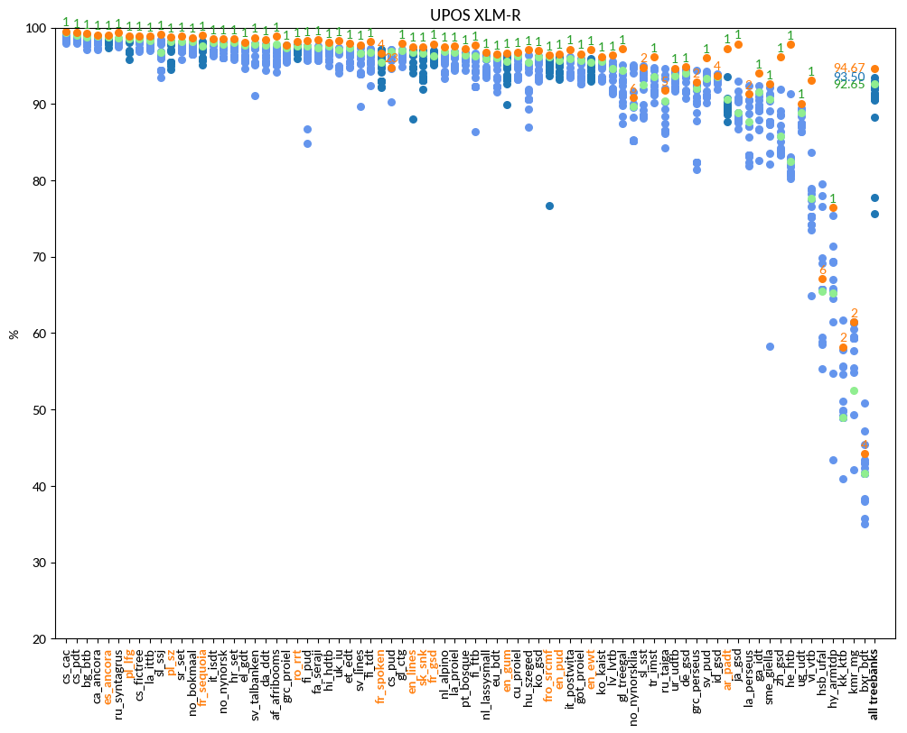

# UPOS

language | F1 (UDParse BERT) | F1 (UDParse + XLM-R) | F1 (Udpipe) | F1 (Best team)
-------- | ---------------- | ------------------- | ----------- | --------------
af_afribooms |  98.41  |  **98.9**  | 97.82 |  97.82  UDPipe Future (Praha)
ar_padt  |  97.05  |  **97.3**  | 90.64 |  93.63  Stanford (Stanford)
bg_btb   |  98.96  |  **99.21**  | 98.83 |  99.03  HIT-SCIR (Harbin)
bxr_bdt  |  43.88  |  44.21  | 41.66 |  **50.83**  Uppsala (Uppsala)
ca_ancora |  98.96  |  **99.07**  | 98.85 |  98.85  UDPipe Future (Praha)
cs_cac   |  99.31  |  **99.52**  | 99.33 |  99.35  LATTICE (Paris)
cs_fictree |  98.62  |  **98.92**  | 98.49 |  98.56  LATTICE (Paris)
cs_pdt   |  99.18  |  **99.35**  | 99.01 |  99.07  Uppsala (Uppsala)
cs_pud   |  94.80  |  94.8  | 96.84 |  **97.17**  NLP-Cube (București)
cu_proiel |  **96.86**  |  96.82  | 96.34 |  96.43  HIT-SCIR (Harbin)
da_ddt   |  97.83  |  **98.39**  | 97.72 |  97.88  HIT-SCIR (Harbin)
de_gsd   |  94.87  |  **94.89**  | 94.04 |  94.50  HIT-SCIR (Harbin)
el_gdt   |  98.04  |  **98.1**  | 97.73 |  97.93  HIT-SCIR (Harbin)
en_ewt   |  97.02  |  **97.1**  | 95.43 |  95.94  LATTICE (Paris)
en_gum   |  **96.83**  |  96.7  | 95.55 |  96.44  LATTICE (Paris)
en_lines |  97.49  |  **97.53**  | 96.77 |  97.06  LATTICE (Paris)
en_pud   |  96.59  |  **96.59**  | 95.68 |  96.21  LATTICE (Paris)
es_ancora |  98.98  |  **99.07**  | 98.80 |  98.80  HIT-SCIR (Harbin)
et_edt   |  97.59  |  **97.91**  | 97.31 |  97.40  HIT-SCIR (Harbin)
eu_bdt   |  95.94  |  **96.54**  | 96.08 |  96.45  HIT-SCIR (Harbin)
fa_seraji |  97.92  |  **98.38**  | 97.32 |  97.60  HIT-SCIR (Harbin)
fi_ftb   |  96.45  |  **97.67**  | 96.28 |  96.70  HIT-SCIR (Harbin)
fi_pud   |  98.11  |  **98.27**  | 97.61 |  97.65  LATTICE (Paris)
fi_tdt   |  97.47  |  **98.14**  | 96.75 |  97.30  HIT-SCIR (Harbin)
fr_gsd   |  **97.93**  |  97.86  | 96.32 |  96.97  Stanford (Stanford)
fr_sequoia |  **99.08**  |  98.96  | 97.56 |  98.15  Stanford (Stanford)
fr_spoken |  96.47  |  96.6  | 95.47 |  **97.17**  LATTICE (Paris)
fro_srcmf |  96.37  |  **96.37**  | 96.22 |  96.22  UDPipe Future (Praha)
ga_idt   |  92.92  |  **94.02**  | 91.58 |  92.36  TurkuNLP (Turku)
gl_ctg   |  97.80  |  **97.93**  | 96.98 |  97.07  TurkuNLP (Turku)
gl_treegal |  96.92  |  **97.22**  | 94.44 |  95.12  SLT-Interactions (Bengaluru)
got_proiel |  96.54  |  **96.58**  | 95.75 |  95.95  HIT-SCIR (Harbin)
grc_perseus |  92.18  |  92.88  | 92.10 |  **94.38**  HIT-SCIR (Harbin)
grc_proiel |  97.69  |  **97.75**  | 97.34 |  97.75  HIT-SCIR (Harbin)
he_htb   |  97.14  |  **97.81**  | 82.53 |  91.36  Stanford (Stanford)
hi_hdtb  |  97.73  |  **98.06**  | 97.56 |  97.57  HIT-SCIR (Harbin)
hr_set   |  98.36  |  **98.49**  | 98.02 |  98.07  HIT-SCIR (Harbin)
hsb_ufal |  64.98  |  67.13  | 65.51 |  **79.53**  LATTICE (Paris)
hu_szeged |  96.28  |  **97.07**  | 95.48 |  96.43  HIT-SCIR (Harbin)
hy_armtdp |  72.90  |  **76.48**  | 65.29 |  75.39  Uppsala (Uppsala)
id_gsd   |  93.76  |  93.74  | 93.55 |  **93.94**  CEA LIST (Paris)
it_isdt  |  **98.52**  |  98.49  | 98.09 |  98.13  HIT-SCIR (Harbin)
it_postwita |  96.41  |  **97.17**  | 95.99 |  96.13  Stanford (Stanford)
ja_gsd   |  97.72  |  **97.89**  | 88.88 |  92.97  HIT-SCIR (Harbin)
kk_ktb   |  56.87  |  58.22  | 48.94 |  **61.72**  Uppsala (Uppsala)
kmr_mg   |  59.37  |  61.44  | 52.50 |  **61.53**  CUNI x-ling (Praha)
ko_gsd   |  96.31  |  **96.97**  | 96.13 |  96.33  HIT-SCIR (Harbin)
ko_kaist |  95.79  |  **96.21**  | 95.65 |  95.68  HIT-SCIR (Harbin)
la_ittb  |  98.58  |  **98.85**  | 98.28 |  98.52  HIT-SCIR (Harbin)
la_perseus |  88.52  |  91.31  | 87.64 |  **92.41**  HIT-SCIR (Harbin)
la_proiel |  96.81  |  **97.61**  | 96.75 |  96.86  HIT-SCIR (Harbin)
lv_lvtb  |  95.43  |  **96.37**  | 94.63 |  95.62  HIT-SCIR (Harbin)
nl_alpino |  97.14  |  **97.51**  | 96.90 |  96.90  UDPipe Future (Praha)
nl_lassysmall |  96.47  |  **96.73**  | 95.98 |  96.48  HIT-SCIR (Harbin)
no_bokmaal |  98.34  |  **98.69**  | 98.14 |  98.15  HIT-SCIR (Harbin)
no_nynorsk |  98.22  |  **98.53**  | 97.88 |  98.11  HIT-SCIR (Harbin)
no_nynorsklia |  90.85  |  90.85  | 89.74 |  **95.12**  SLT-Interactions (Bengaluru)
pl_lfg   |  98.76  |  **98.93**  | 98.56 |  98.69  HIT-SCIR (Harbin)
pl_sz    |  98.41  |  **98.78**  | 98.20 |  98.20  UDPipe Future (Praha)
pt_bosque |  97.26  |  **97.26**  | 96.37 |  96.71  SLT-Interactions (Bengaluru)
ro_rrt   |  98.04  |  **98.2**  | 97.56 |  97.66  Stanford (Stanford)
ru_syntagrus |  99.17  |  **99.35**  | 98.71 |  98.71  UDPipe Future (Praha)
ru_taiga |  90.73  |  91.78  | 90.42 |  **94.62**  LATTICE (Paris)
sk_snk   |  97.01  |  **97.54**  | 96.65 |  97.02  HIT-SCIR (Harbin)
sl_ssj   |  98.81  |  **99.1**  | 96.83 |  98.40  Stanford (Stanford)
sl_sst   |  94.04  |  94.79  | 92.58 |  **95.05**  HIT-SCIR (Harbin)
sme_giella |  92.32  |  **92.66**  | 90.65 |  92.14  HIT-SCIR (Harbin)
sr_set   |  98.70  |  **98.89**  | 98.18 |  98.18  UDPipe Future (Praha)
sv_lines |  97.29  |  **97.75**  | 96.66 |  97.37  HIT-SCIR (Harbin)
sv_pud   |  95.56  |  **96.05**  | 93.31 |  94.28  LATTICE (Paris)
sv_talbanken |  98.17  |  **98.7**  | 97.79 |  97.90  HIT-SCIR (Harbin)
tr_imst  |  95.43  |  **96.13**  | 93.58 |  94.78  HIT-SCIR (Harbin)
ug_udt   |  88.96  |  **90.09**  | 88.92 |  89.43  CEA LIST (Paris)
uk_iu    |  97.74  |  **98.29**  | 97.17 |  97.41  HIT-SCIR (Harbin)
ur_udtb  |  94.08  |  **94.68**  | 93.68 |  94.54  TurkuNLP (Turku)
vi_vtb   |  91.21  |  **93.12**  | 77.61 |  83.62  HIT-SCIR (Harbin)
zh_gsd   |  96.04  |  **96.2**  | 85.83 |  91.94  HIT-SCIR (Harbin)

